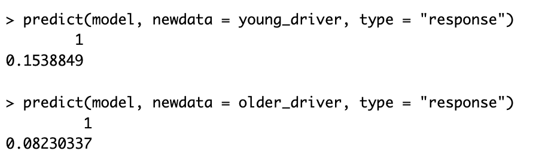
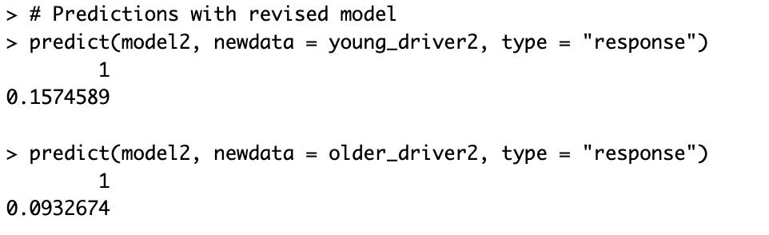
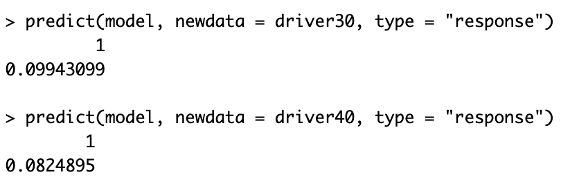
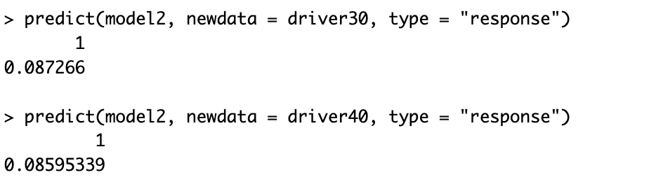

# Motor Insurance Claim Frequency Model (R)

## Intro

This project uses open-source French motor insurance data to build a simple claim frequency model in R. I used it as an opportunity to refresh my R skills and get hands-on experience with Generalised Linear Models (GLMs), the standard technique actuaries use for pricing.

## Data

The dataset is `freMTPL2freq`, containing 677,991 motor third-party liability policies observed over one year — a widely used dataset in actuarial teaching and research. Key columns include `ClaimNb`, `Exposure`, `DrivAge`, `BonusMalus`, and `Region`.

## Data Source
This project uses the `freMTPL2freq` dataset, available from OpenML:
https://www.openml.org/search?type=data&id=41214

Download the file and update the file path in `claim_frequency_model.R` to match its location on your machine.


## Exploratory Findings

Average claim frequency showed a clear age pattern: a sharp decline from 18 to the early 30s, followed by a gradual rise through the 40s, then a noisier, less consistent pattern from 45 to 65. Past 65, the pattern becomes erratic and unpredictable, likely due to shrinking sample sizes.

**Sample size by age:**


**Average claim frequency by age:**


An overdispersion check compared the mean and variance of claim counts (mean ≈ 0.053, variance ≈ 0.058). Since a Poisson distribution assumes these are equal, a higher variance would understate standard errors, making results look more statistically significant than they really are. Here, the ratio was very close to 1, suggesting Poisson was a reasonable choice.

## Model 1: Linear Age

The first model was built using a Poisson GLM with predictors: driver age, Bonus Malus (driving history), and region. An offset of `log(Exposure)` ensures the model compares policies on a claims-per-year basis, rather than raw claim counts, so a policy observed for only one month isn't unfairly treated the same as one observed for a full year.

```r
model <- glm(
  ClaimNb ~ DrivAge + BonusMalus + Region,
  offset = log(Exposure),
  family = poisson(link = "log"),
  data = data
)
```

As expected, Bonus Malus produced a positive coefficient (≈0.022), suggesting worse driving history is associated with higher claim frequency. However, age also yielded a positive coefficient (≈0.0073), implying that higher age results in more claims — which differs from the declining trend seen in the raw data.

Holding Bonus Malus at 60 and Region at R24, the model predicted 0.078 claims per year for an 18-year-old driver, compared to 0.094 for a 50-year-old — implying the older driver was riskier, contradicting the declining age trend seen in the raw data.

Investigating this, I found that Bonus Malus itself varies with age: younger drivers have a notably higher Bonus Malus score. This meant age and Bonus Malus were negatively correlated, so fixing Bonus Malus at the same value for both drivers had removed most of the risk signal that age normally carries.

## Model 2: Age Bands + Realistic Bonus Malus

Two changes were made:
1. Converting driver age into age bands, so the model could capture its non-linear shape rather than forcing a straight line.
2. Using realistic, age-typical Bonus Malus values instead of a single fixed value for both drivers.

```r
data$AgeBand <- cut(
  data$DrivAge,
  breaks = c(17, 25, 35, 45, 55, 65, 100),
  labels = c("18-25", "26-35", "36-45", "46-55", "56-65", "66+")
)

model2 <- glm(
  ClaimNb ~ AgeBand + BonusMalus + Region,
  offset = log(Exposure),
  family = poisson(link = "log"),
  data = data
)
```

Together, these produced predictions much closer to the true average-claims-by-age trend:

| | Model 1 (linear age) | Model 2 (age bands) |
|---|---|---|
| 18-year-old / 18-25 band | 0.078 | 0.157 |
| 50-year-old / 46-55 band | 0.094 | 0.093 |




### Isolating which change actually mattered

To check whether age-banding itself made a genuine difference — separate from the Bonus Malus fix — I compared drivers aged 30 and 40 using the **same realistic Bonus Malus score in both models**.

```r
driver30 <- data.frame(DrivAge = 30, AgeBand = "26-35", BonusMalus = 69.28, Region = "R24", Exposure = 1)
driver40 <- data.frame(DrivAge = 40, AgeBand = "36-45", BonusMalus = 57.52, Region = "R24", Exposure = 1)
```

| Age | True avg. frequency | Model 1 (linear age) | Model 2 (age bands) |
|---|---|---|---|
| 30 | 0.043 | 0.099 | 0.087 |
| 40 | 0.050 | 0.082 | 0.086 |




The linear-age model predicted a notably higher claim rate for the 30-year-old, which differs from the real data, where the two ages have similar claim frequencies. The age-band model produced much closer predictions — confirming that age-banding itself was a genuine improvement, not just an artefact of the Bonus Malus correction.

## Conclusions & Limitations

From this project I learnt that a Poisson distribution was a suitable choice for modelling this data, that using a linear age term was incorrect given the true non-linear age-risk relationship, and that you should always sanity-check and question model results against real-world expectations rather than accepting them at face value.

With more time, I would incorporate additional predictors — such as vehicle power or regional population density — to further refine the model.

## Files

- [`claim_frequency_model.R`](claim_frequency_model.R) — full R script
- `images/` — plots and prediction outputs referenced above
