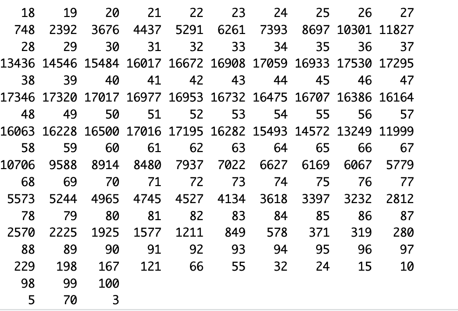
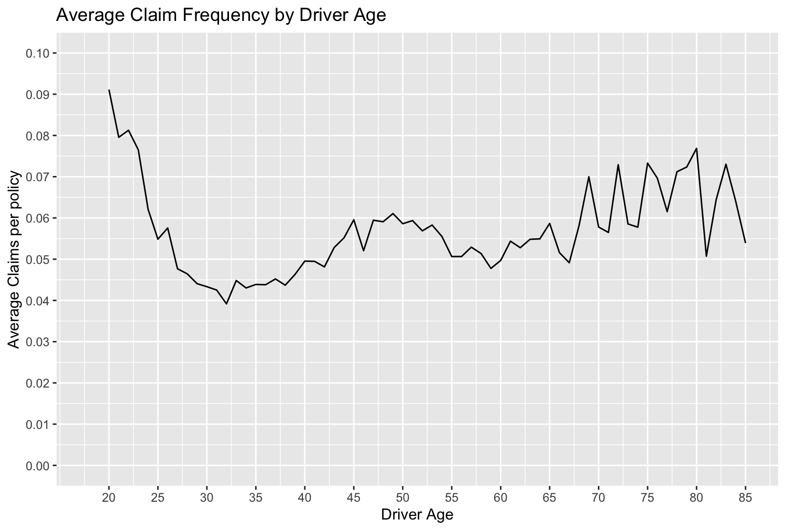

# Motor Insurance Claim Frequency Model (R)

## Intro

This project uses open-source French motor insurance data to build a simple claim frequency model in R. I used it as an opportunity to refresh my R skills and get hands-on experience with Generalised Linear Models (GLMs), the standard technique actuaries use for pricing.

## Data

The dataset is `freMTPL2freq`, containing 677,991 motor third-party liability policies observed over one year — a widely used dataset in actuarial teaching and research. Key columns include `ClaimNb`, `Exposure`, `DrivAge`, `BonusMalus`, and `Region`.

## Data Source
This project uses the `freMTPL2freq` dataset, available from OpenML:
https://www.openml.org/search?type=data&id=41214

Download the file and update the file path in `claim_frequency_model.R` to match its location on your machine.


## Exploratory Findings

Average claim frequency showed a clear age pattern: a sharp decline from 18 to the early 30s, followed by a gradual rise through the 40s, then a noisier, less consistent pattern from 45 to 65. Past 65, the pattern becomes erratic and unpredictable, likely due to shrinking sample sizes.

**Sample size by age:**



**Average claim frequency by age:**



An overdispersion check compared the mean and variance of claim counts (mean ≈ 0.053, variance ≈ 0.058). Since a Poisson distribution assumes these are equal, a higher variance would understate standard errors, making results look more statistically significant than they really are. Here, the ratio was very close to 1, suggesting Poisson was a reasonable choice.

## Model 1: Linear Age

The first model was built using a Poisson GLM with predictors: driver age, Bonus Malus (driving history), and region. An offset of `log(Exposure)` ensures the model compares policies on a claims-per-year basis, rather than raw claim counts, so a policy observed for only one month isn't unfairly treated the same as one observed for a full year.

```r
model <- glm(
  ClaimNb ~ DrivAge + BonusMalus + Region,
  offset = log(Exposure),
  family = poisson(link = "log"),
  data = data
)
```

As expected, Bonus Malus produced a positive coefficient (≈0.022), suggesting worse driving history is associated with higher claim frequency. However, age also yielded a positive coefficient (≈0.0073), implying that higher age results in more claims — which differs from the declining trend seen in the raw data.

Holding Bonus Malus at 60 and Region at R24, the model predicted 0.078 claims per year for an 18-year-old driver, compared to 0.094 for a 50-year-old — implying the older driver was riskier, contradicting the declining age trend seen in the raw data.

Investigating this, I found that Bonus Malus itself varies with age: younger drivers have a notably higher Bonus Malus score. This meant age and Bonus Malus were negatively correlated, so fixing Bonus Malus at the same value for both drivers had removed most of the risk signal that age normally carries.

## Model 2: Age Bands + Realistic Bonus Malus

Two changes were made:
1. Converting driver age into age bands, so the model could capture its non-linear shape rather than forcing a straight line.
2. Using realistic, age-typical Bonus Malus values instead of a single fixed value for both drivers.

```r
data$AgeBand <- cut(
  data$DrivAge,
  breaks = c(17, 25, 35, 45, 55, 65, 100),
  labels = c("18-25", "26-35", "36-45", "46-55", "56-65", "66+")
)

model2 <- glm(
  ClaimNb ~ AgeBand + BonusMalus + Region,
  offset = log(Exposure),
  family = poisson(link = "log"),
  data = data
)
```

Together, these produced predictions much closer to the true average-claims-by-age trend:

| | Model 1 (linear age) | Model 2 (age bands) |
|---|---|---|
| 18-year-old / 18-25 band | 0.078 | 0.157 |
| 50-year-old / 46-55 band | 0.094 | 0.093 |


### Isolating which change actually mattered

To check whether age-banding itself made a genuine difference — separate from the Bonus Malus fix — I compared drivers aged 30 and 40 using the **same realistic Bonus Malus score in both models**.

```r
driver30 <- data.frame(DrivAge = 30, AgeBand = "26-35", BonusMalus = 69.28, Region = "R24", Exposure = 1)
driver40 <- data.frame(DrivAge = 40, AgeBand = "36-45", BonusMalus = 57.52, Region = "R24", Exposure = 1)
```

| Age | True avg. frequency | Model 1 (linear age) | Model 2 (age bands) |
|---|---|---|---|
| 30 | 0.043 | 0.099 | 0.087 |
| 40 | 0.050 | 0.082 | 0.086 |


The linear-age model predicted a notably higher claim rate for the 30-year-old, which differs from the real data, where the two ages have similar claim frequencies. The age-band model produced much closer predictions — confirming that age-banding itself was a genuine improvement, not just an artefact of the Bonus Malus correction.

## Conclusions & Limitations

From this project I learnt that a Poisson distribution was a suitable choice for modelling this data, that using a linear age term was incorrect given the true non-linear age-risk relationship, and that you should always sanity-check and question model results against real-world expectations rather than accepting them at face value.

Update: the frequency-only model above was later extended into a full pricing model, combining a severity model with the frequency model to produce a genuine pure premium — see the #extension-full-pricing-model-frequency--severity below.

With more time, I would incorporate additional predictors — such as vehicle power or regional population density — to further refine the model.

## Extension: Full Pricing Model (Frequency × Severity)

### Intro

This extension builds on the original frequency model to address a limitation noted earlier — the absence of a severity model needed for a genuine pure premium. It further develops my understanding of R and GLMs, building directly on the findings from the frequency model above.

### Data

The severity dataset, `freMTPL2sev`, contains claim amounts for 26,639 motor third-party liability claims — far fewer than the 677,991 policies in the frequency dataset, since it only includes policies that actually claimed (consistent with the earlier finding that only ~5% of policies claimed at all). Each claim links back to a policy via a shared `IDpol` column.

**Data source:** available from OpenML: https://www.openml.org/search?type=data&id=41215

Download the file and update the file path in `pricing_model.R` to match its location on your machine.

### Findings

75% of claims were €1,228.10 or below, while the mean claim amount was €2,278.50 — dragged up by a small number of very large, genuine claims (up to ≈€4.1 million). The majority of policies that claimed did so only once (23,571 policies), with very few claiming more than 3 times in the year.

### Severity Model

Since claim amounts are continuous, positively skewed, and always greater than zero, a Gamma GLM was used, with the same predictors as the age-banded frequency model: driver age band, Bonus Malus (driving history), and region.

```r
sev_model <- glm(
  ClaimAmount ~ AgeBand + BonusMalus + Region,
  family = Gamma(link = "log"),
  data = claims_only
)
```

The only statistically significant predictor of claim severity was `AgeBand`. All age bands from 26-35 onward showed significantly lower expected claim amounts than the 18-25 baseline, suggesting that when younger drivers do have an accident, it tends to be more severe than for other age groups.

### Combining Both Models: Pure Premium

Using both models together, a pure premium can be calculated as:

```
Pure Premium = Predicted Frequency × Predicted Severity
```

Exposure was set to 1 for all policies when predicting, so premiums are calculated on a fair, annual basis.

**Predicted pure premium by age band:**

| AgeBand | Predicted Pure Premium |
|---|---|
| 18-25 | £951.61 |
| 26-35 | £221.80 |
| 36-45 | £202.15 |
| 46-55 | £215.97 |
| 56-65 | £191.94 |
| 66+ | £248.47 |

This was validated against the actual annualised claims cost per age band. An initial validation attempt mistakenly compared predictions against a claims average calculated using an overwritten exposure column, producing a misleadingly large gap; correcting this to use each policy's true exposure gave a fairer comparison:

| AgeBand | Actual Annualised Claim Cost |
|---|---|
| 18-25 | £758.40 |
| 26-35 | £153.14 |
| 36-45 | £138.18 |
| 46-55 | £138.08 |
| 56-65 | £121.05 |
| 66+ | £141.93 |

The model consistently overpredicted, by roughly **1.25x–1.75x** across age bands, with the gap widening slightly at older ages.

### A Concrete Example

Using the same young (18-25, typical Bonus Malus) and older (46-55, typical Bonus Malus) driver profiles from the frequency model, the predicted pure premiums were:

| Driver | Predicted Pure Premium |
|---|---|
| 18-25 year old | £905.70 |
| 46-55 year old | £207.91 |

The younger driver's premium was roughly **4.4x higher**, driven by both higher predicted claim frequency and higher predicted claim severity compounding together.

### Conclusions & Limitations (Pricing Extension)

From this addition, I learnt that a Gamma distribution is well suited to modelling claim severity, how to merge and filter datasets to combine frequency and severity information, and a basic understanding of how insurance premiums are constructed from frequency and severity models.

The remaining gap between predicted premiums and actual annualised claims cost (roughly 1.25–1.75x) is likely due to the limited set of predictors used — a fuller model including vehicle and geographic risk factors would likely narrow this further.


## Files

- [`claim_frequency_model.R`](claim_frequency_model.R) — full R script
- [`pricing_model.R`](pricing_model.R) - full R script
- `images/` — supporting plot and table


